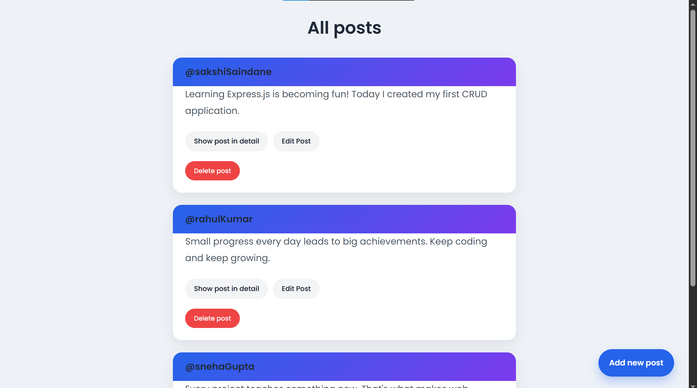
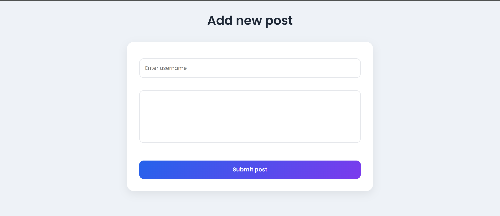
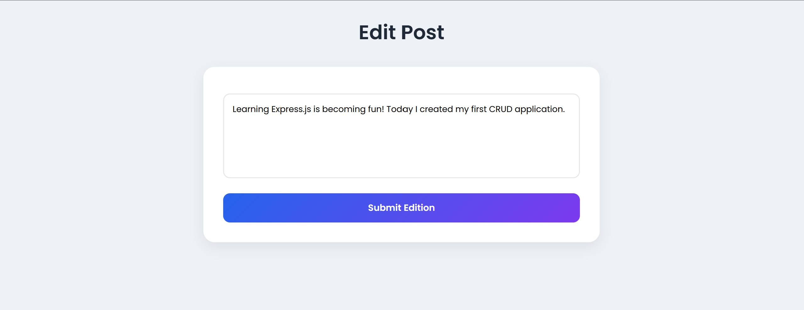
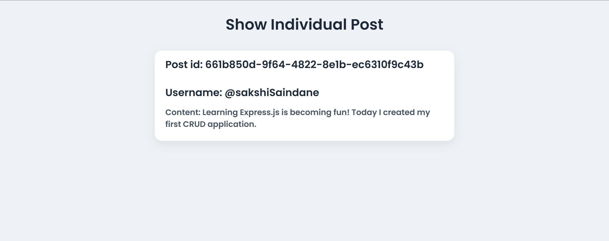

# Mini Blog CRUD Application

A simple CRUD (Create, Read, Update, Delete) web application built using Node.js, Express.js, EJS, and CSS.

## Features

* View all posts
* Create a new post
* View post details
* Edit existing posts
* Delete posts
* Dynamic routing with Express
* Method Override for PATCH and DELETE requests

## Technologies Used

* Node.js
* Express.js
* EJS
* HTML
* CSS
* UUID
* Method Override

## Screenshots

### Home Page

### Add New Post

### Edit Post

### Show Post

## Learning Outcomes

This project helped me understand Express routing, middleware, form handling, CRUD operations, dynamic templates using EJS, and RESTful APIs.
